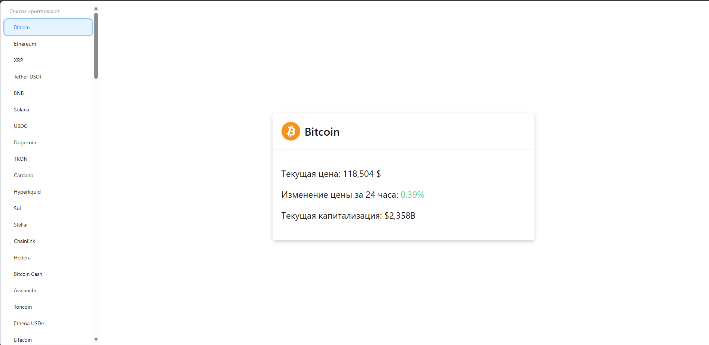
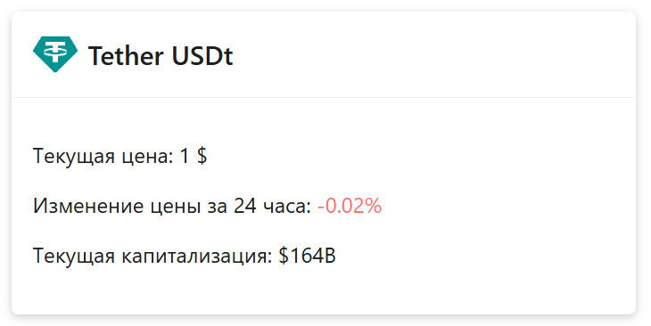

# 🪙 Crypto FastAPI

REST API-сервер для получения криптовалютных данных с CoinMarketCap, реализованный на **FastAPI** с асинхронным HTTP-клиентом `aiohttp`.  
Frontend написан на **React + StateJS (SJ)**.

---

## 🚀 Функционал

🔹 Получение списка криптовалют  
🔹 Получение информации по конкретной валюте по `id`  
🔹 CORS-настройка для работы с фронтендом  
🔹 Асинхронный доступ к CoinMarketCap API через собственный HTTP-клиент  
🔹 Загрузка API-ключа из `.env`

---
## 📁 Установка проекта
### 1.Утсновка зависимостей backend

```bash
cd backend
python -m venv venv
venv\Scripts\activate   # или source venv/bin/activate на Linux/macOS
pip install -r requirements.txt
```
### 2.Создай файл .env в корне:

```dotenv
CMC_API_KEY=твой_ключ_от_coinmarketcap
```

### 3.Запусти сервер:

```bash
uvicorn src.main:app --reload

```
---

## ⚛️ Frontend (React + SJ)
### 1. Перейди в папку frontend:

```bash
1. cd frontend
```
### 2. Установи зависимости:

```bash
npm install
```
### 3. Запусти dev-сервер:

```bash
npm run dev
```
Frontend будет доступен по:
🌐 http://localhost:5173

---
## 📦 API Эндпоинты
| Метод | Путь                    | Описание                   |
| ----- | ----------------------- | -------------------------- |
| GET   | `/crypto/`              | Список криптовалют         |
| GET   | `/crypto/{currency_id}` | Информация по валюте по ID |

---

## 📸 Скриншоты
### Главная


### Окно валюты


---

🛠️ Технологии
Python 3.11+
* FastAPI
* aiohttp
* Pydantic / pydantic-settings
* CoinMarketCap API
* React + SJ
* Vite


